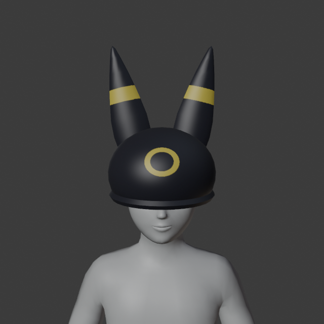
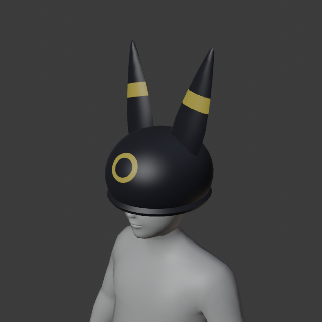
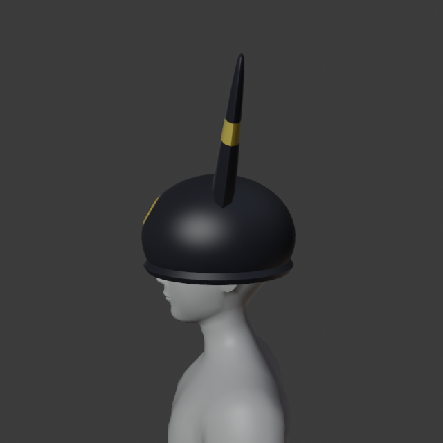
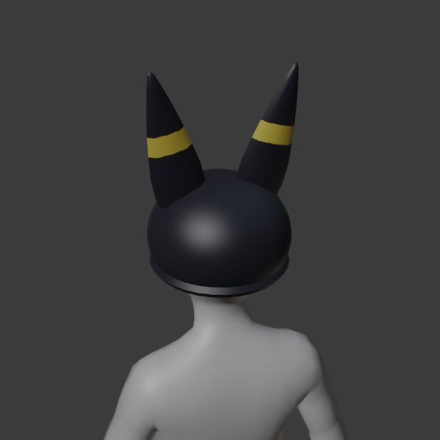
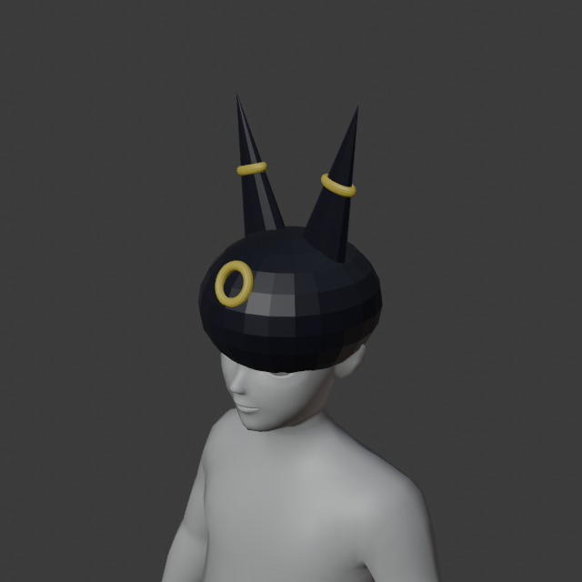

# Test: an Umbreon hat for Roblox

How the [`roblox-avatar`](../../skills/roblox-avatar/SKILL.md) skill was tested. A fresh
Claude Code agent got only the blender-mcp tools, on headless Blender 4.2, with
`execute_python` off and the skill installed. The workspace held Roblox's
`RthroMannequin.fbx` and `Rig_and_Attachments_Template.fbx`. The prompt:

> Make me an Umbreon hat (the Pokémon) for my Roblox avatar: a black beanie-style hat
> with Umbreon's long ears and its yellow ring markings. Blender is connected through
> the blender MCP tools and Roblox's mannequin and rig template are already in the
> Blender workspace. Get it ready to bring into Roblox Studio as a wearable hat, and
> tell me the steps for the Studio side. Save the .blend too.

**Fan art, for a local test only.** Umbreon is Nintendo / Game Freak / The Pokémon
Company IP. Roblox's Marketplace policy forbids uploading or selling it. Both runs told
the user so unprompted and offered an original design for anything public.

## Result (round 2)

| Front | 3/4 | Side | Back |
| --- | --- | --- | --- |
|  |  |  |  |

- `check_roblox_asset` (rigid, `hat`, Normal, attachment = `Hat_Att`) returned ok with
  no warnings:
  - 2,624 triangles (limit 4,000);
  - watertight, no n-gons;
  - one material, one UV map, one 1024² texture;
  - 1.0 × 1.39 × 1.05 studs, reaching 1.20 of the allowed 1.25 above the attachment.
- Files:
  - [`UmbreonHat.fbx`](UmbreonHat.fbx): FBX Unit Scale, texture embedded. It
    re-imports at the same size with one material and its image packed.
  - [`UmbreonHat.png`](UmbreonHat.png): the baked texture.
- Runtime and cost: 127 turns, 500 s, about $2.40. The agent's first checks failed on
  "2 materials" and on n-gons; it fixed both before exporting.
- Studio handle: `HatAttachment` at (0, -0.507, 0) inside the Handle, as reported by
  the check.

## Round 1, and what changed in the skill

The first run passed the checks too: 3,930 triangles, 158 s, $0.61. But it didn't read
as Umbreon:

- the ears were thin spikes;
- the yellow markings were separate torus rings floating on the surface, which also
  ate most of the triangle budget;
- the cap was faceted.

The hat recipe (`references/rigid-accessories.md`) and the modelling step in
`SKILL.md` now say:

- list the character's recognisable features first;
- paint markings as face selections that get baked, not as extra objects;
- smooth-shade;
- aim for 500–2,000 triangles.

Round 2 followed all of that.

## Not tested

Nothing here ran inside Roblox Studio: no Studio on Linux, and no uploads for IP
reasons. That covers the import, the Accessory Fitting Tool, the attachment offset
and wearing it in play. The FBX settings and sizes follow the creator docs and
Roblox's own template files, and the stud scale was checked against their mannequin
(6.27 studs tall; the docs say 5.75–6.5).
